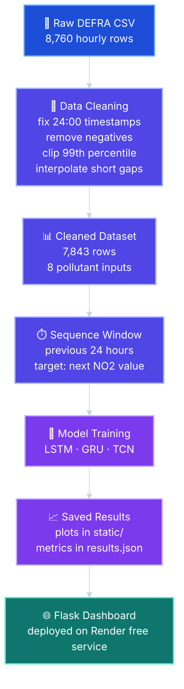

# 🌫️ NO2 Forecasting Dashboard

<p align="center">
  <strong>A Flask dashboard for forecasting hourly NO2 at London Marylebone Road using LSTM, GRU, and TCN models.</strong>
</p>

<p align="center">
  
  
  
  
</p>

<p align="center">
  <a href="https://no2-forecasting-dashboard.onrender.com/">
    
  </a>
</p>

## ✨ What This Project Does

This project predicts the next hourly NO2 value using recent air quality readings from the UK DEFRA AURN London Marylebone Road station.

I cleaned the 2025 hourly dataset, trained three deep learning models, compared their test results, and deployed the saved plots in a Flask dashboard.

The deployed app does not train online. It only serves the saved charts and the saved `results.json` metrics.

## 🏆 Best Result

| Model | MAE | MSE | RMSE | MAPE |
|---|---:|---:|---:|---:|
| 🥇 **LSTM** | **4.5460** | **37.0458** | **6.0865** | **22.9770** |
| GRU | 5.9759 | 57.5909 | 7.5889 | 36.6754 |
| TCN | 10.8209 | 183.8128 | 13.5578 | 72.0659 |

**LSTM performed best with RMSE 6.0865 ug/m^3.**

## 🧠 Architecture Diagram



## 📸 Dashboard Preview

<p align="center">
  
  
</p>

## 📌 Dataset

📍 **Station:** London Marylebone Road  
🏷️ **Site ID:** MY1  
📄 **File:** `MY1_2025.csv`  
🧾 **Source:** UK DEFRA Automatic Urban and Rural Network  
🧮 **Raw rows:** 8,760  
✅ **Cleaned rows:** 7,843  
🎯 **Target:** NO2  
🌡️ **Inputs:** CO, PM10, NO, NO2, NOx, O3, PM2.5, SO2

The final `31-12-2025 24:00` record is converted to `2026-01-01 00:00`, which is why the cleaned timestamp range ends at the first hour of 2026.

## 🛠️ What I Used

🐍 Python for the main project code  
🧹 pandas, NumPy, and scikit-learn for cleaning and scaling  
🧠 TensorFlow for LSTM, GRU, and Conv1D TCN models  
📊 Matplotlib for the saved dashboard plots  
🌐 Flask for the dashboard  
🚀 Render free web service for deployment

## 📂 Project Files

📌 `data.py` handles cleaning, scaling, splitting, and 24 hour windows  
📌 `models.py` builds the LSTM, GRU, and TCN models  
📌 `train.py` trains the models and saves the plots  
📌 `app.py` runs the Flask dashboard  
📌 `results.json` stores the final metrics  
📌 `static/` stores the generated chart images  
📌 `render.yaml` keeps the Render deployment setup

## 🚀 Run Locally

```bash
git clone https://github.com/abinashprasana/no2-forecasting-deep-learning.git
cd no2-forecasting-deep-learning
pip install -r requirements.txt
python train.py
python app.py
```

Open:

```text
http://localhost:5000
```

## 🌐 Deployment

The live dashboard is hosted on Render using the saved plots and saved metrics.

```bash
Build Command: pip install -r requirements-deploy.txt
Start Command: gunicorn app:app
```

## 🔍 Notes

1. This is based on one monitoring station, so it should not be treated as a general model for every location.
2. The project uses one year of hourly data.
3. The model predicts the next NO2 value from the previous 24 hours.
4. The LSTM gave the best saved test result in this run.

## 👤 Author

**Abinash Prasana Selvanathan**

Data source: https://uk-air.defra.gov.uk
