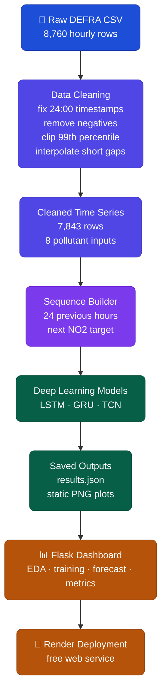
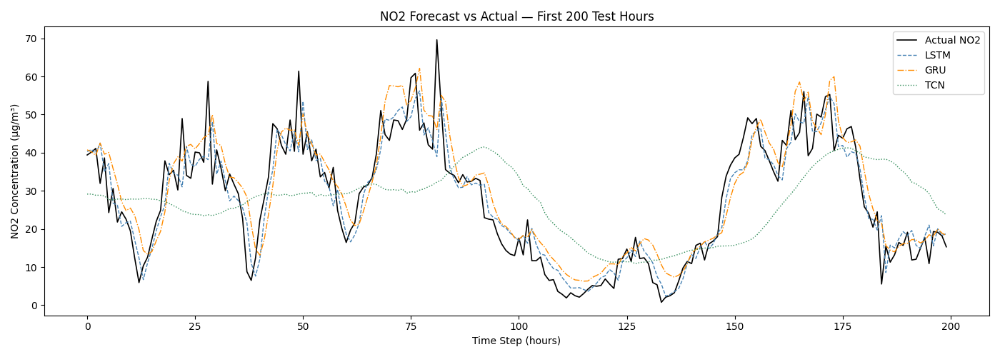
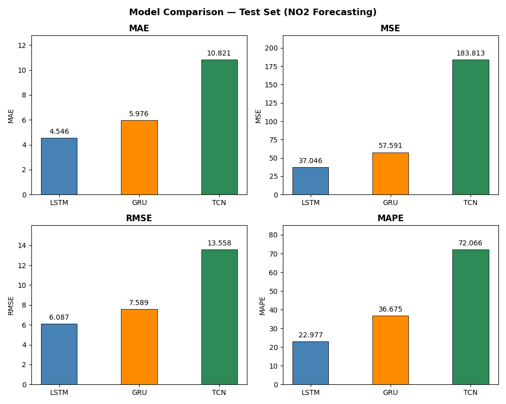

<div align="center">

# 🌫️ NO2 Forecasting Dashboard

**A deep learning dashboard that forecasts hourly NO2 at London Marylebone Road using real UK DEFRA AURN air quality data.**

[](.)
[](.)
[](.)
[](https://no2-forecasting-dashboard.onrender.com/)
[](.)

<br/>

*DEFRA AURN · London Marylebone Road · 7,843 cleaned rows · 24 hour lookback · LSTM best model*

</div>

---

## 🌐 Live Dashboard

[](https://no2-forecasting-dashboard.onrender.com/)

The dashboard is deployed on Render free service. It loads the saved plots from `static/` and the saved model results from `results.json`.

The hosted app does not retrain the deep learning models online, so it stays lightweight and quick to deploy.

---

## 📖 What This Project Is

This project looks at hourly air quality readings from the London Marylebone Road monitoring station and predicts the next NO2 value from the previous 24 hours.

I cleaned the raw DEFRA CSV, handled missing and invalid values, built time series windows, trained three neural network models, and compared their results on the same held out test set.

The final Flask dashboard brings the work together in one place. It shows the data checks, training loss curves, forecast comparisons, scatter plots, and final metrics without needing to rerun training.

---

## ⚡ Quick Stats

<div align="center">

| | 🧾 Raw Rows | ✅ Cleaned Rows | ⏱️ Lookback | 🧠 Models | 🏆 Best RMSE |
|:---:|:---:|:---:|:---:|:---:|:---:|
| **Value** | **8,760** | **7,843** | **24 hours** | **LSTM · GRU · TCN** | **6.0865** |

</div>

---

## 🏆 Model Results

<div align="center">

| Model | MAE | MSE | RMSE | MAPE (%) |
|:---:|---:|---:|---:|---:|
| 🥇 **LSTM** | **4.5460** | **37.0458** | **6.0865** | **22.9770** |
| GRU | 5.9759 | 57.5909 | 7.5889 | 36.6754 |
| TCN | 10.8209 | 183.8128 | 13.5578 | 72.0659 |

</div>

The LSTM gave the lowest RMSE on the saved test results. The GRU was second, and the TCN was weaker in this run.

---

## 🗃️ Dataset

<div align="center">

| Detail | Value |
|:---|:---|
| 📍 Station | London Marylebone Road |
| 🏷️ Site ID | MY1 |
| 🌐 Source | UK DEFRA Automatic Urban and Rural Network |
| 📄 File | `MY1_2025.csv` |
| 🎯 Target | NO2 |
| 🌡️ Inputs | CO, PM10, NO, NO2, NOx, O3, PM2.5, SO2 |
| 🧾 Raw rows | 8,760 |
| ✅ Cleaned rows | 7,843 |

</div>

The raw file is an hourly 2025 dataset. The final `31-12-2025 24:00` record is converted to `2026-01-01 00:00`, which is why the cleaned timestamp range ends at the first hour of 2026.

---

## 🧠 System Architecture



---

## ⚙️ Model Details

<div align="center">

| Model | Architecture |
|:---:|:---|
| LSTM | LSTM 64, LSTM 32, Dense 1 |
| GRU | GRU 64, GRU 32, Dense 1 |
| TCN | Conv1D 64, Conv1D 64 dilation 2, Conv1D 32 dilation 4, GlobalAveragePooling1D, Dense 1 |

</div>

All three models use Adam optimizer, MSE loss, early stopping, and learning rate reduction on plateau.

---

## 📊 Dashboard Preview

<div align="center">




</div>

---

## 💻 Dashboard Sections

**Overview**  
Shows the cleaned row count, number of inputs, 24 hour lookback window, and best model.

**Data**  
Shows pollutant trends, the March NO2 close up, monthly NO2 average, and the feature correlation plot.

**Training**  
Shows the training and validation loss curves for LSTM, GRU, and TCN.

**Forecast**  
Compares actual NO2 values with model predictions on the held out test set.

**Metrics**  
Shows MAE, MSE, RMSE, and MAPE for all three models.

---

## 📁 Project Structure

```text
no2-forecasting-dashboard/
├── 📄 app.py                    Flask dashboard
├── 📄 data.py                   data loading, cleaning, scaling, and windowing
├── 📄 models.py                 LSTM, GRU, TCN builders and metric calculation
├── 📄 train.py                  training pipeline and plot generation
├── 📄 results.json              saved test metrics
├── 📄 render.yaml               Render deployment config
├── 📄 requirements.txt          local training dependencies
├── 📄 requirements-deploy.txt   lightweight deployment dependencies
├── 📦 static/                   saved dashboard plots
└── 📦 MY1_2025.csv              DEFRA source file used in this project
```

---

## ⚙️ How to Run

**1. Clone the repository**
```bash
git clone https://github.com/abinashprasana/no2-forecasting-deep-learning.git
cd no2-forecasting-deep-learning
```

**2. Install dependencies**
```bash
pip install -r requirements.txt
```

**3. Train and generate plots**
```bash
python train.py
```

**4. Start the dashboard**
```bash
python app.py
```

Open `http://localhost:5000` in your browser.

---

## 🚀 Deployment

The Render deployment uses the saved results only.

```bash
Build Command: pip install -r requirements-deploy.txt
Start Command: gunicorn app:app
```

This keeps the hosted app simple because TensorFlow is only needed when training locally.

---

## ⚠️ Notes

This is a student project built around one monitoring station and one year of hourly data. The results are useful for comparing the three model approaches on this dataset, but they should not be treated as a general air quality model for every location.

Future improvements could include adding time features such as hour of day, testing more years of data, tuning the TCN, and comparing against simpler baselines.

---

## 👤 Author

**Abinash Prasana Selvanathan**

Data source: https://uk-air.defra.gov.uk
